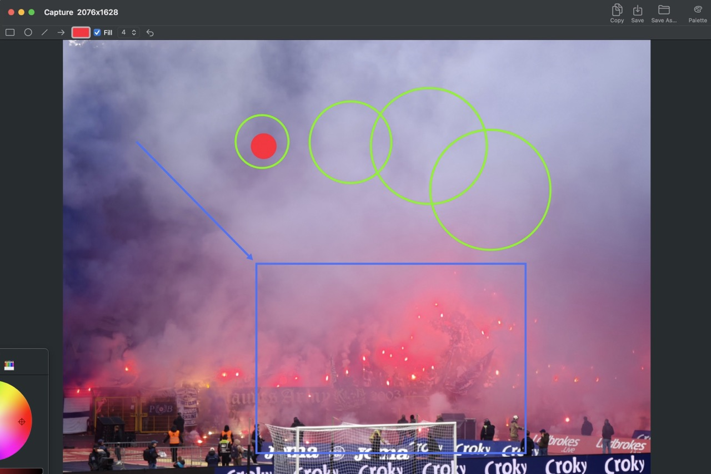

# DotMenu

A macOS menu bar screen capture utility with drawing tools. Click the dashed-square icon in the menu bar, capture any screen region, and annotate with shapes before copying or saving.

> Vibecoded in one day as an experiment — an old idea I wanted to build 10 years ago but never found the time. Made with [opencode](https://opencode.ai) and DeepSeek 4 Flash (paid + free tiers). Total cost: less than $1.

<p align="center">
  
</p>

<p align="center">
  <a href="https://iesta.github.io/DotMenu/">Website</a>
</p>

## Features

- **Capture modes** — Selection (interactive crosshair), Full screen, Foremost window
- **Drawing tools** — Rectangle, Circle, Line, Arrow with color picker, Fill toggle, and line width selector
- **Larger toolbar buttons** — 36×28 buttons in the drawing bar for easier clicking
- **Filled arrowhead** — arrow tip rendered as a filled triangle, shaft meets precisely at the base
- **Copy to pasteboard** — copies the annotated image (Cmd+C, Enter, or toolbar button)
- **Save to disk** — saves PNG to `~/Pictures/DotMenu/` with prefix (`sel-`, `full-`, `win-`) (Cmd+S); Save As… for custom location
- **Undo** — removes the last drawn shape (Cmd+Z)
- **Extract palette** — K-Means clustering on the original image, popover with 5 dominant colors, click to set drawing color + copy hex
- **Keyboard shortcuts** when capture window is active: R (Rectangle), C (Circle), L (Line), A (Arrow)
- **Global hotkeys** — Cmd+Shift+7 (selection), Cmd+Shift+! (full screen), Cmd+Shift+ç (window) via Carbon `RegisterEventHotKey` (configurable in Preferences)
- **Capture history** — last 10 captures persisted to disk; accessible from the menu bar; includes final annotated version
- **Menu bar** — File (New Capture, Close, Close All, Save, Save As, Preferences) and Edit (Undo, Copy) menus appear when a window is active
- **Automatic activation** — app appears in the Dock when a capture window is open, menu-bar-only when closed
- **Permission guided** — denied Screen Capture access opens System Settings automatically

## Build & Install

```sh
make install
```

Builds `DotMenu.app`, copies it to `/Applications`, and launches it. The app is ad-hoc code-signed with a **stable designated requirement** (`identifier "com.example.DotMenu"`) so the TCC permission grant survives rebuilds.

| Command       | Effect                                     |
|---------------|--------------------------------------------|
| `make build`  | Build `DotMenu.app` in the project root    |
| `make dmg`    | Build and package into `DotMenu.dmg`       |
| `make run`    | Build and launch from the project root     |
| `make clean`  | Remove build artifacts and generated files |

## First-time setup

1. Run `make install`
2. Click **Capture selection** in the menu bar or press **Cmd+Shift+7**
3. If prompted, grant **Screen Capture** access
4. Select a screen region, or use Capture full screen (Cmd+Shift+!) / Capture window (Cmd+Shift+ç)
5. Draw annotations using the drawing bar buttons
6. Copy (Cmd+C or Enter) or Save (Cmd+S)

## Usage tips

- Hold **Shift** while dragging to constrain Rectangle/Circle to a perfect square/circle
- Hold **Shift** while dragging an Arrow to constrain its angle
- **Palette** button extracts 5 dominant colors from the image — click a swatch to set drawing color + copy hex
- **File prefixes**: `sel-` (selection), `full-` (full screen), `win-` (window) in `~/Pictures/DotMenu/`
- Window size adapts to 85% of screen width for full captures
- History appears in the menu bar; click to reopen last incarnation (with drawings)

## Version system

Each build increments an auto-generated version (5-digit, starting at `00001`). Displayed in Preferences.

```
src/version.txt             # Current version (incremented after successful build)
src/VersionGenerated.swift  # Auto-generated: `let appVersion = "000XX"`
```

## Project structure

```
src/
├── main.swift           # Single source file — AppKit + SwiftUI
├── Info.plist           # LSUIElement = true, CFBundleIdentifier = com.example.DotMenu
├── AppIcon.icns         # Finder icon
├── version.txt          # Build version counter
└── VersionGenerated.swift   # Auto-generated, .gitignored

docs/
├── index.html           # Website (GitHub Pages)
├── DotMenu.dmg          # Downloadable DMG
└── example.jpeg         # Screenshot

Makefile                 # Build, sign, install, launch, dmg
AGENTS.md                # Agent development notes
README.md                # This file
```

## Technical details

- **No Xcode project or Package.swift** — bare `swiftc` compilation
- **No asset catalog** — the dashed-square icon is drawn at runtime with `NSBezierPath`
- **No Dock icon by default** — `.accessory` activation policy, switches to `.regular` when a capture window is open
- **Single source file** — `src/main.swift`, compiled with `-framework AppKit -framework SwiftUI`
- **Code signing** — ad-hoc signed with `--requirements '=designated => identifier "com.example.DotMenu"'` for stable TCC tracking
- **Global hotkeys** — Carbon `RegisterEventHotKey` for selection (id=1), full screen (id=2), window (id=3); stored in UserDefaults
- **Screen Capture permission** — checked via `CGPreflightScreenCaptureAccess()` before each capture; denied → opens System Settings
- **Capture engine** — `/usr/sbin/screencapture` via `Process` with `-i` (selection), no flag (full screen), or `-W` (window)
- **Drawing overlay** — transparent `DrawingOverlayView` on top of `NSImageView`, tracks mouse events, renders with `NSBezierPath`
- **Arrowhead** — filled polygon triangle, shaft shortened by `cos(π/6)` to meet the base precisely
- **Palette extraction** — K-Means clustering on downsampled image (150px max), pure Swift implementation
- **Composited export** — Copy/Save combine the original image + all shapes into a single PNG
- **History persistence** — PNG + JSON in `~/Pictures/DotMenu/.history/`, same filename as capture file


